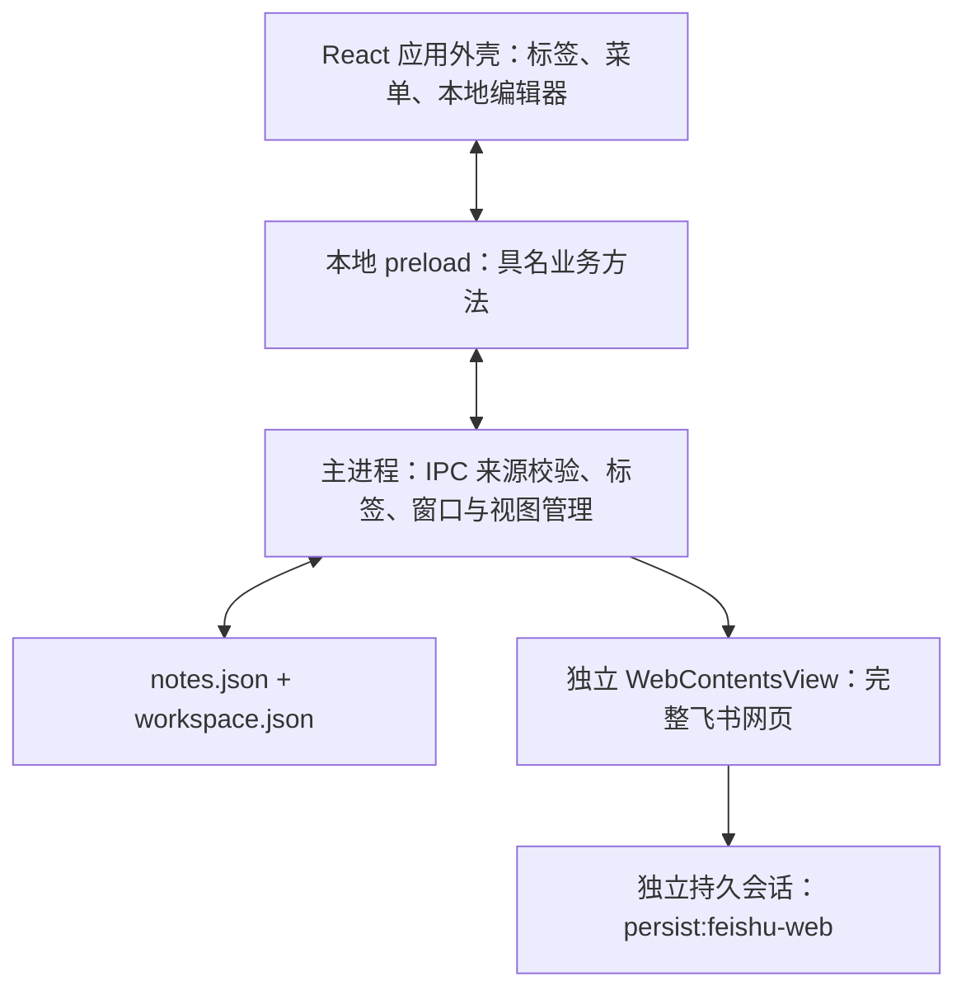

# 飞书文档窗口技术设计

> 状态：Electron 阶段的历史设计，接口及模块均尚未实现；2026-10-03。
> 应用已迁移到 Tauri。本文中的 BrowserWindow / WebContentsView / preload 方案不再适用于当前代码；飞书网页登录、SSO、输入法及多 WebView 兼容性须重新设计和验证。当前只保留本地便签与飞书 API 同步，不提供内嵌网页编辑。
> 对应产品设计：[飞书文档标签](../prd/feishu-document-tabs-prd.md)。

## 1. 现状与选择

当前 `src/main.ts` 创建单个 `BrowserWindow`，加载本地 React UI，通过 preload 暴露本地便签等能力。主窗口禁止网页导航和新窗口；`links:open` 使用 `shell.openExternal`。`App.tsx` 只有 `Note` 列表，唤起会聚焦本地编辑器。

保持本地 UI 的 `BrowserWindow`，由主进程为已打开的飞书标签创建独立 `WebContentsView`，加入窗口的 `contentView`。不让承载本地 preload 的页面导航到飞书。该 API 已在项目安装的 Electron 类型中确认存在。

Electron 的网页视图不属于 React DOM，主进程负责布局、焦点和生命周期。[官方网页嵌入说明](https://www.electronjs.org/docs/latest/tutorial/web-embeds)及 [WebContentsView API](https://www.electronjs.org/docs/latest/api/web-contents-view)支持这一路线。普通 iframe 受目标页面的嵌入策略限制；官方也不推荐新用 `<webview>`。

飞书官方文档组件保留为后续选择。它的用户身份鉴权支持按用户权限访问；应用身份鉴权不支持编辑，因此不能把当前 API 同步凭证直接接到组件上作为编辑能力。[飞书组件接入说明](https://open.feishu.cn/document/common-capabilities/web-components/uYDO3YjL2gzN24iN3cjN/introduction)

## 2. 模块与进程



建议职责分配，实际命名在实现时统一：

| 路径 | 职责 |
| --- | --- |
| `src/main.ts` | 应用启动、窗口控制、注册 IPC 与装配管理器 |
| `src/platform/web/feishuViews.ts` | 视图池、加载、焦点、布局、页面关闭与崩溃恢复 |
| `src/platform/web/navigationPolicy.ts` | URL、顶层导航、重定向、新窗口、外部链接策略 |
| `src/platform/workspaceStore.ts` | 标签元数据、顺序、选中项、窗口尺寸持久化与兼容恢复 |
| `src/shared/workspace.ts` | 纯类型、无副作用的 URL 解析和标签标识规则 |
| `src/preload.ts` / `src/renderer/env.d.ts` | 本地外壳的最小接口与类型 |
| `src/renderer/` | 混合标签、文档工具栏、面板、错误页；新增文案全部进 `i18n.ts` |

`src/platform/sync/` 继续处理用户触发的 API 同步。网页登录会话、网页加载状态和同步令牌之间不建立隐式转换。

## 3. 存储与兼容

保留 `notes.json` 和现有 `Note` 结构。新增 `workspace.json`，仅承载标签入口，不把文档正文写入 `Note.content`。

```ts
type WorkspaceTab =
  | { id: string; kind: "local"; noteId: string }
  | {
      id: string;
      kind: "feishu";
      url: string;           // 经校验的稳定文档 URL，不含登录回调参数
      documentKey: string;   // 主机 + docx/wiki + 文档标识
      alias?: string;       // 用户自定义显示名称
      pageTitle?: string;   // 仅接受文档地址上的标题，作为展示缓存
      createdAt: string;
    };

type WorkspaceState = {
  schemaVersion: 1;
  tabs: WorkspaceTab[];      // 固定排列顺序
  activeTabId?: string;
  windowSizes: {
    local?: { width: number; height: number };
    feishu?: { width: number; height: number };
  };
};
```

- 首次迁移按现有便签顺序生成本地标签引用；已有便签、附件、主题和飞书同步映射不重写为新类型。
- 新建便签先落盘 `Note`，再写标签引用。启动时补入未被引用的现存便签、清理指向已不存在便签的引用，修复跨两个文件写入中断的情况。
- `workspace.json` 使用串行快照和同目录临时文件原子替换；结构校验失败时保留原文件并提示恢复，不能静默覆盖丢失全部文档链接。
- 恢复选中项失败时选择第一个有效标签；没有便签和文档时进入可新建的空状态。只加载当前飞书标签，其他链接按需加载。
- 主进程拥有标签、去重键和视图映射；renderer 不提供存储路径、会话标识或 `webContentsId`。文档显示名称优先 alias，其次已缓存标题，再次“飞书文档”。
- 在文档路径收到 `page-title-updated` 时按纯文本、长度上限存储。登录页、错误页或未知导航的标题不覆盖已知文档名称，不执行 HTML。
- 入口 URL 严格限定 HTTPS、`feishu.cn` 或其真实子域、`/docx/<token>` 或 `/wiki/<token>`；拒绝账号密码、非默认端口及伪装域名。复用现有解析思路，不放宽 API 同步目标的校验。
- 持久 URL 去除查询和片段以避免保存临时凭证；用户粘贴的原始文档链接可用于首次内存导航，片段定位不保证重启恢复。去重不跨主机或 wiki/docx 类型猜测别名。

## 4. 独立会话和权限边界

飞书视图及受控登录窗口显式设置：

```ts
{
  partition: "persist:feishu-web",
  contextIsolation: true,
  nodeIntegration: false,
  sandbox: true,
  webSecurity: true,
  // 不配置本地 preload，不开启 webviewTag。
}
```

使用相同 `persist:` 分区可在应用内共享持久会话；这不会继承系统浏览器的登录。[Electron WebPreferences](https://www.electronjs.org/docs/latest/api/structures/web-preferences)

新增与既有本地 IPC 都必须校验发送方为受信本地外壳的主 frame，并匹配允许的开发地址或打包资源地址；远程视图、登录子窗口、子 frame 一律不能调用本地笔记、附件、凭据和窗口控制 IPC。生产构建不接受任意开发地址。

远程会话安装请求和检查两类权限策略：按来源与功能校验，未实现的摄像头、麦克风、屏幕捕获等拒绝授权；剪贴板等功能在实际复制粘贴验证后只开放必要能力。网页自己的文件选择上传继续使用浏览器文件选择器，不转成应用的本地附件。

下载只响应真实用户发起的操作，交给明确的保存流程，不自动打开下载文件或导入便签。Cookie、认证跳转 URL、令牌和完整请求头不进入诊断日志或 renderer 状态。应用不解析页面私有接口、不注入脚本读取正文或截取 Cookie。

清除网页登录：先统一提示，再逐页正常关闭；任一页取消则停止后续关闭且不清除存储。已关闭页保留标签及未加载状态，不宣称多页面关闭是原子操作。全部视图和登录窗口正常结束后，仅清除 `persist:feishu-web` 的存储与缓存，验证结果后报告成功。不操作默认 session，不删除 `sync-config.bin`。

## 5. 导航和登录窗口

必须分开处理“添加文档入口”和“运行中的导航”。添加入口只接受文档链接；登录期间会出现认证页面，不能套用文档路径正则阻断所有认证，也不能因此放开任意网站。

| 场景 | 策略 |
| --- | --- |
| 打开已保存文档 | 主进程从标签记录取 URL，执行受控 `loadURL` |
| 同一文档的站内导航 | 按已验证 origin 和路径分类允许；不覆盖标签的稳定入口 |
| 导向另一篇已支持的飞书文档 | 拦截后走添加/激活标签流程，原页面保留 |
| 已验证的飞书认证跳转 | 原视图继续导航，回到文档后恢复文档状态 |
| `window.open` 登录页 | 创建同一会话、相同安全设置的受控认证窗口，保留经验证的 opener / 回调关系 |
| 登录流程遇到未知 IdP / SSO 域 | 停止此流程并给出不兼容提示；用户可将原文档在系统浏览器打开，不假设系统浏览器 Cookie 会回流 |
| 普通外站 HTTP(S) 链接 | 拦截，交给应用外壳显示目标域名，由用户明确选择在浏览器打开 |
| `file:`、`javascript:`、`data:`、未知自定义协议 | 拒绝顶层导航和系统打开；飞书客户端唤起只在完成精确协议验证后另行支持 |

文档加载、`will-navigate`、重定向和新窗口都使用同一策略，不能只校验初次 URL。该策略针对顶层导航和新窗口，不把文档域白名单粗暴套到全部 CDN 子资源上。

认证 origin、重定向链、弹窗特征和 opener 需求必须由原型实际观察确认。不能凭经验硬编码一份“全部登录域名”，也不能把整个认证链直接丢给系统浏览器后声称应用内已登录。校验过程只记录必要域名与结果，不保存带凭据的查询串。

外壳和受控认证窗口显示当前已校验的真实 origin，不将登录页伪装成文档地址。跨页面推送只包含必要的 origin 和导航类别，不携带完整认证 URL。

飞书网页内的后退前进能力先保留给其自身；首版外壳不提供通用地址栏和浏览历史。提供“刷新文档”和“在浏览器打开”时使用已保存的稳定文档 URL，避免暴露或打开当前登录回调地址。

## 6. 布局、遮挡与焦点

本地外壳保留一个主 `webContents`；活动飞书视图占据顶部 44 px 标题栏及 36 px 文档工具栏以下的内容区域。尺寸使用逻辑像素，主进程按内容区边界计算并限制范围。首版固定外壳缩放为 100%，网页缩放只影响网页自身。

视图通过 `setBounds` 随窗口 resize 更新，不能接受 renderer 任意指定屏幕坐标。高 DPI、多屏、平台窗口边框和小屏幕需实际验证；尺寸不足时优先压缩工具栏文字并保留可点击控件。

React `z-index` 无法可靠覆盖原生网页视图。打开菜单或模态面板时先等待主进程隐藏活动视图的确认，再显示面板及中性遮罩；关闭后根据最新活动标签恢复视图。使用递增版本或操作令牌丢弃过时的打开/关闭响应，防止快速切换恢复了错误页面。

失焦逻辑区分外壳失焦和整个应用窗口失焦。网页获得焦点不意味着应用窗口离开；面板隐藏视图期间不让异步网页事件抢回焦点。面板关闭时恢复当前模式的焦点。

全局快捷键由主进程继续注册；前后切换的意图交给外壳执行本地草稿保存，再请求主进程激活目标标签。焦点位于飞书时不调用现有 `focusEditor()`；切换完成且无面板时使用目标 `webContents.focus()`。输入法、网页快捷键和浏览器菜单行为以真实操作验收。

## 7. 状态与生命周期

页面状态与选中状态、可见状态、保存状态分离：

```ts
type DocumentPageState =
  | { status: "unloaded" }
  | { status: "loading"; startedAt: number; slow: boolean }
  | { status: "loaded" }
  | { status: "load-error"; reason: string }
  | { status: "crashed" };
```

`loaded` 只代表导航加载完成，不能派生为可编辑、已登录或已保存。只处理主 frame 的加载失败；忽略已被正常新导航取代的中止事件，避免把图片失败当整页故障。SPA 内的权限、保存和业务错误由飞书显示。

- 首次激活创建视图；加载超过 20 秒显示“加载时间较长”，允许继续等待、重试或在浏览器打开，不因定时器触发而销毁页面。
- 切换标签、隐藏窗口、最小化和打开面板都不执行 reload / close。非活动页面从可见区域隐藏，保留实例。
- 默认沿用浏览器后台节流，原型必须测试立即隐藏后的保存。如果出现实际中断，先定位原因，再评估调整 `backgroundThrottling` 的资源成本，不能承诺隐藏等于同步成功。
- 视图池最多保留 5 个文档实例，认证窗口另设小规模上限并禁止无限递归弹窗。页面达到上限时需要用户选择关闭，不能自动 LRU 淘汰可能有未保存编辑的页面。
- 页面崩溃保留标签和错误状态，不自动重载掩盖输入丢失。用户请求恢复后创建新实例。
- 正常关闭显式使用 `webContents.close({ waitForBeforeUnload: true })` 并处理 `will-prevent-unload`。用户选择留下时不调用该事件的 `preventDefault()`；它在此事件中反而表示允许离开。网页未阻止关闭也不能证明云端已保存，因此外壳对会卸载页面的操作提供一次明确说明，不重复堆叠相同确认。[Electron 关闭页面语义](https://www.electronjs.org/docs/latest/api/web-contents#contentscloseopts)
- 卸载操作允许取消。移除标签只有在页面正常关闭、元数据持久化成功后才报告成功；持久化失败保留入口并提示重试。
- 应用退出前统一提示，再逐页正常关闭；任一取消则停止后续关闭与退出，先前已关闭页保留标签，仍存活页面继续保留。全部页面允许关闭后才完成退出，清理认证窗口、事件监听器和所有受管 `webContents`，不以强制销毁绕过未保存确认。

窗口移除视图不等于销毁其 `webContents`。应显式管理清理，避免退出或重建窗口时泄漏。[Electron 资源管理说明](https://www.electronjs.org/docs/latest/api/base-window#resource-management)

## 8. 拟新增 preload 契约

以下为设计接口，不表示当前已经暴露。所有输入、状态变更及调用来源在主进程验证。

| 方法 | 输入 / 作用 |
| --- | --- |
| `getWorkspace()` | 获取标签及当前模式快照，包含已加载列表和资源上限 |
| `addFeishuTab({ url, alias? })` | 校验、去重、持久化；返回新建或已存在标签 |
| `activateTab(tabId)` | 由外壳完成本地保存后调用；按需创建页面并返回结果 |
| `renameFeishuTab({ tabId, alias })` | 只改本地显示名称 |
| `removeFeishuTab(tabId)` | 正常关闭及移除本地入口，不调用远端删除 API |
| `reloadFeishuTab(tabId)` | 经离开流程后重新加载稳定文档 URL |
| `closeFeishuPage(tabId)` | 卸载页面、保留标签 |
| `openFeishuInBrowser(tabId)` | 从主进程记录取 URL，再交系统打开 |
| `setWorkspaceOverlay({ visible, revision })` | 协调菜单遮罩与网页可见性；返回已应用版本 |
| `toggleDocumentExpanded()` | 在当前可用区域内放大或恢复 |
| `clearFeishuWebSession()` | 仅清除专用网页登录会话 |
| `onWorkspaceChanged(callback)` | 返回取消订阅函数；推送无认证信息的标签和页面状态 |

结果区分成功、用户取消、链接不支持、页面额度已满、存储失败等。不暴露任意 `loadURL`、执行 JavaScript、Cookie、session、`ipcRenderer`、文件路径或命令执行能力。已有本地便签方法继续由本地编辑器使用，只有本地标签可触发附件和同步动作。

## 9. 实施与验证门槛

### 阶段 A：兼容性原型

使用当前 Electron 版本和独立测试会话验证：真实文档登录、扫码、正常编辑、中文输入法与粘贴、保存后另一客户端读取、立即隐藏后的保存、登录弹窗、重启会话复用。分别记录普通飞书登录与实际目标租户的 SSO 结果；不把一个租户的成功扩大为全部租户支持。

产出可核查的导航 origin 列表、登录窗口策略、视图布局截图和验收结果。未完成时，功能只能标记“原型 / 待验证”。如果只能加载但不能编辑，停止扩展标签功能并修订路线。

### 阶段 B：完整本地集成

实现工作区存储和迁移、最小 IPC、混合标签与固定顺序、模式尺寸、视图池、遮罩和焦点。同步结果只桥接为标签入口，保留现有同步契约。

有意义的自动化覆盖：URL 伪装与去重、存储中断恢复、IPC 发起来源、认证导航和未知跳转拒绝、视图额度、快速切换乱序响应、取消关闭不丢标签、本地草稿保存失败不切换。

### 阶段 C：回归与交付

运行 `npm run typecheck`、`npm run test:contracts` 和 `npm run build`。补充 Electron 实际运行验证，覆盖原生视图遮挡、全局快捷键、失焦、输入法、多屏尺寸和退出清理；这些不能只靠 jsdom 或源码正则测试证明。

使用用户指定的测试文档，由用户主动完成外部编辑验收，核对产品文档的验收清单。再更新总体 PRD、架构和交接中的能力状态。自动化通过、开发态验证、安装包验证和真实飞书保存分别记录；本设计没有完成任何一项实现验收。
